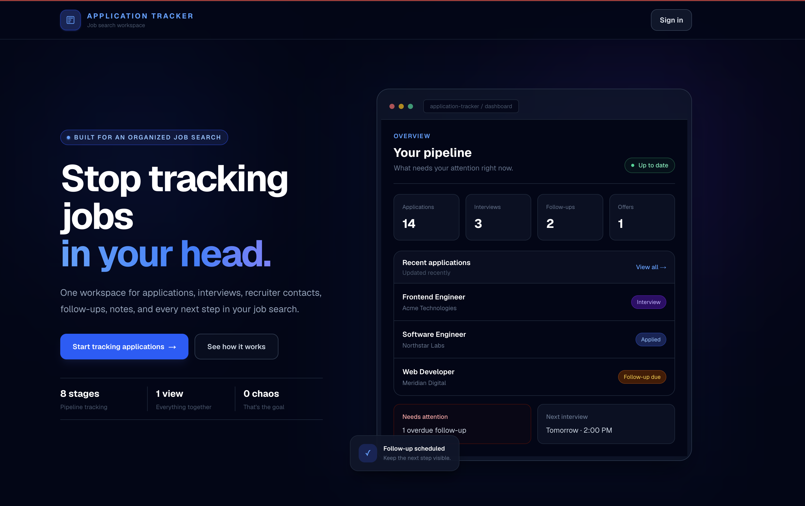
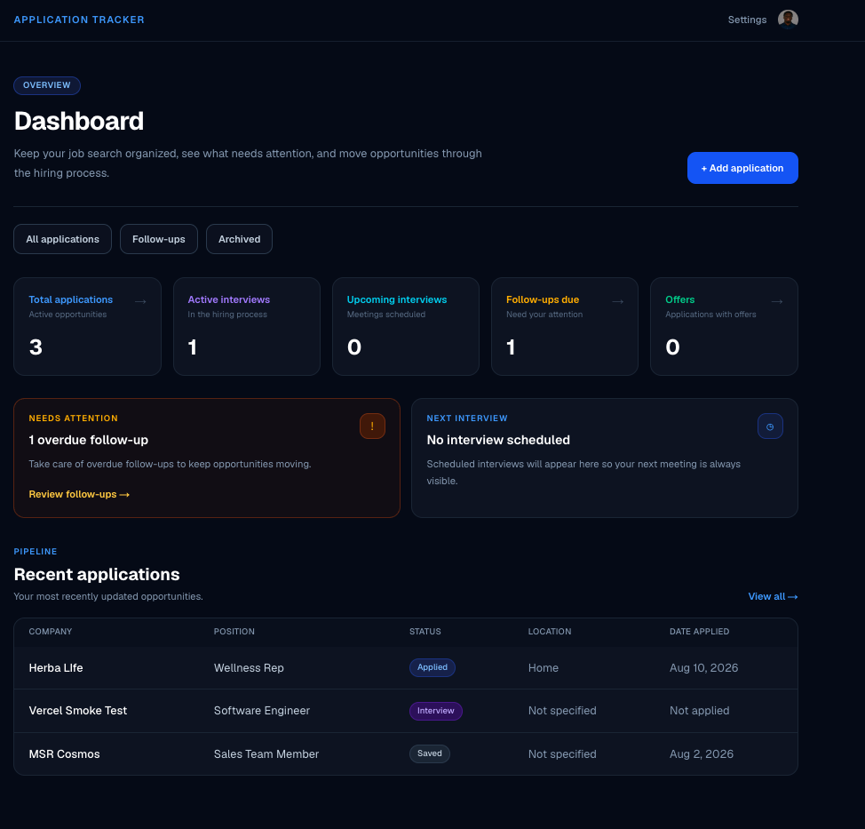
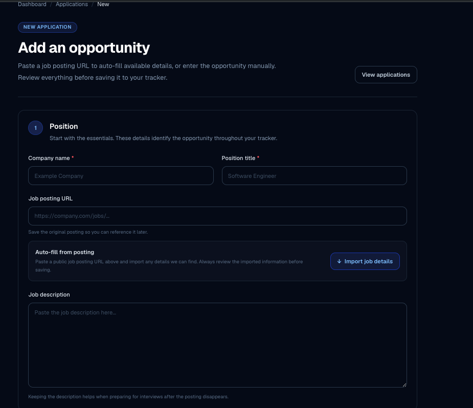
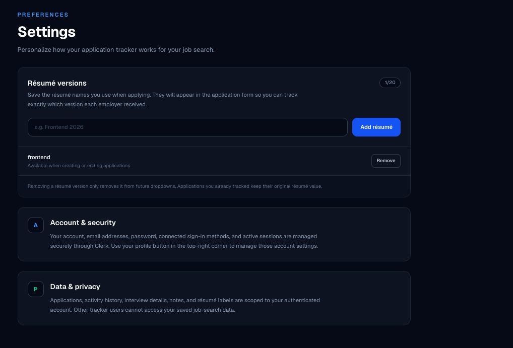
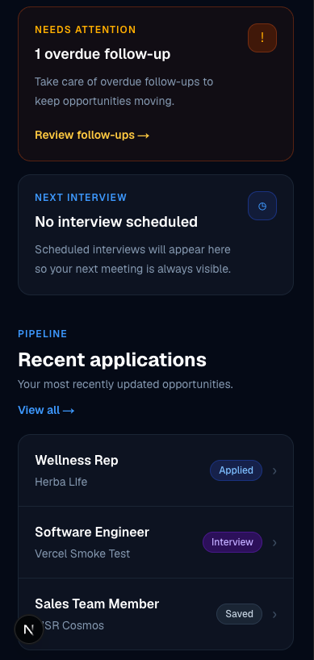

# Application Tracker

A full-stack job application management platform for organizing opportunities, follow-ups, interviews, contacts, résumé versions, and application history in one place.

Built with **Next.js, TypeScript, PostgreSQL, Prisma, Clerk, and Tailwind CSS**.

> Instead of managing a job search across spreadsheets, notes, browser tabs, and reminders, Application Tracker provides one structured workflow from saved opportunity to offer.

## Live Demo

**Live Application:** https://application-tracker-teal-pi.vercel.app/

**Repository:** https://github.com/MelvinBerkoh/application-tracker

---

## Screenshots

### Landing Page



### Dashboard



### Application Management



### Settings



### Mobile Experience



---

## Features

### Application Management

- Create, view, edit, archive, restore, and manage job applications
- Track company, position, location, compensation, job URL, source, contacts, and private notes
- Move opportunities through a structured hiring pipeline:
  - Saved
  - Applied
  - Recruiter Screen
  - Interview
  - Assessment
  - Offer
  - Rejected
  - Withdrawn
- Search and filter tracked applications
- Preserve application history as opportunities change over time

### Job Posting Import

Paste a job posting URL and Application Tracker attempts to automatically populate available job details before the application is saved.

The importer can extract information such as:

- Company
- Position title
- Location
- Job description
- Work arrangement
- Application source
- Structured annual salary information
- Original job posting URL

Imported information is always presented for review before saving.

Because some job sites block automated requests or do not expose structured job data, manual entry remains available as a fallback.

### Follow-Up Workflow

- Schedule follow-up dates for individual applications
- Surface applications that currently need attention
- Reschedule or clear follow-ups
- View follow-up workload directly from the dashboard

### Interview Scheduling

- Schedule interviews directly on an application
- Reschedule upcoming interviews
- Cancel scheduled interviews
- Prevent exact-time interview conflicts across active applications
- Surface the next scheduled interview on the dashboard
- Track upcoming interview counts

Interview events are recorded inside each application's activity history instead of being maintained as disconnected calendar records.

### Activity History

Important events are recorded as part of an application's timeline, including:

- Status changes
- Interviews
- Follow-ups
- Notes
- Email activity
- Calls
- Other application events

This keeps the current state of an application and the history that produced it together.

### Personalized Résumé Versions

Users can create their own résumé labels in Settings, such as:

- Frontend 2026
- Full-Stack
- Backend
- General Resume

Those labels become available when creating or editing applications.

Résumé versions already stored on older applications are preserved even if the corresponding option is later removed from Settings, keeping historical application records accurate.

### Dashboard

The dashboard provides an at-a-glance view of the job search, including:

- Total active applications
- Active interview processes
- Upcoming interviews
- Follow-ups due
- Offers
- Next scheduled interview
- Recent applications
- Opportunities requiring attention

### Responsive Design

Application Tracker is designed for both desktop and mobile use.

Desktop views provide information-dense tables, while smaller screens switch to touch-friendly application cards to avoid horizontal scrolling and preserve the most important information.

### Authentication & Authorization

Authentication is handled with Clerk.

Every application, activity, and résumé setting is associated with the authenticated user on the server. Ownership is derived from the active Clerk session rather than trusted browser input.

---

## Engineering Highlights

### Server-Enforced Data Ownership

User ownership is enforced during database operations.

The application does not rely on a browser-provided user ID when deciding who owns or can modify a record.

This prevents one authenticated user from accessing another user's application data simply by manipulating form or request values.

### Historical Data Preservation

Application records store the résumé version that was actually used rather than maintaining a required foreign-key relationship to the user's current résumé options.

That means deleting a résumé option does not rewrite or invalidate historical applications.

### Defensive Job Posting Fetching

The job-posting importer performs server-side URL fetching with safeguards including:

- URL and protocol validation
- Restricted port handling
- DNS and IP inspection
- Private and local network address blocking
- Controlled redirects
- Request timeouts
- Response-size limits
- HTML content-type validation

These controls provide a practical SSRF defense baseline for fetching user-supplied URLs.

The implementation is intentionally treated as defense-in-depth rather than claiming that arbitrary remote URL fetching can be made completely risk-free.

### Structured Server-Side Architecture

The project uses a modular monolith architecture.

Route components focus primarily on routing and composition, while application behavior is organized into feature modules containing:

- Components
- Validation schemas
- Server operations
- Types
- Domain-specific logic
- Tests

This keeps database and business logic out of large page components and makes individual workflows easier to test and maintain.

---

## Tech Stack

| Area             | Technology     |
| ---------------- | -------------- |
| Framework        | Next.js 16     |
| UI               | React 19       |
| Language         | TypeScript     |
| Styling          | Tailwind CSS 4 |
| Database         | PostgreSQL     |
| Database Hosting | Neon           |
| ORM              | Prisma 7       |
| Authentication   | Clerk          |
| Validation       | Zod            |
| HTML Parsing     | Cheerio        |
| Server HTTP      | Undici         |
| Testing          | Vitest         |
| Deployment       | Vercel         |

---

## Architecture

```text
Browser
   |
   v
Next.js App Router
   |
   +-- React Server Components
   +-- Client Components
   +-- Server Actions
   +-- Clerk Authentication
   +-- Zod Validation
   |
   v
Feature Modules
   |
   +-- Application workflows
   +-- Interview workflows
   +-- Follow-up workflows
   +-- Job posting import
   +-- User settings
   |
   v
Prisma ORM
   |
   v
Neon PostgreSQL
```

Application Tracker is deployed as a single Next.js application while maintaining separation between UI, business logic, validation, authentication, and persistence.

---

## Project Structure

```text
application-tracker/
├── prisma/
│   ├── migrations/
│   └── schema.prisma
│
├── public/
│
├── src/
│   ├── app/
│   │   ├── applications/
│   │   ├── dashboard/
│   │   └── settings/
│   │
│   ├── features/
│   │   ├── applications/
│   │   │   ├── components/
│   │   │   ├── lib/
│   │   │   ├── schemas/
│   │   │   ├── server/
│   │   │   └── types/
│   │   │
│   │   └── settings/
│   │       ├── components/
│   │       ├── server/
│   │       └── types/
│   │
│   ├── generated/
│   │   └── prisma/
│   │
│   └── lib/
│       └── prisma.ts
│
├── docs/
├── .env.example
├── package.json
├── prisma.config.ts
└── README.md
```

---

## Database Model

The core database model consists of three primary concepts.

### Application

Stores the current state of a job opportunity, including:

- Company and position
- Application status
- Job description and URL
- Location and work arrangement
- Compensation
- Application source
- Résumé version
- Follow-up date
- Recruiter and contact details
- Notes
- Archive state

### ApplicationActivity

Stores historical activity associated with an application.

Activity types include:

- Notes
- Follow-ups
- Status changes
- Interviews
- Emails
- Calls
- Other events

Activities belong to an application and are deleted if their parent application is deleted.

### ResumeVersion

Stores user-specific résumé labels available in application forms.

Résumé options are owned by the authenticated user and intentionally remain separate from historical résumé strings stored on applications.

---

## Local Development

### Requirements

- Node.js 24
- npm
- PostgreSQL database
- Clerk application

The project requires:

```text
Node >=24 <25
```

If you use `nvm`:

```bash
nvm use
```

### 1. Clone the Repository

```bash
git clone https://github.com/MelvinBerkoh/application-tracker.git
cd application-tracker
```

### 2. Install Dependencies

```bash
npm install
```

Prisma Client is automatically generated through the project's `postinstall` script.

### 3. Configure Environment Variables

Copy the example environment file:

```bash
cp .env.example .env
```

Then configure:

```env
DATABASE_URL=
DIRECT_URL=
NEXT_PUBLIC_CLERK_PUBLISHABLE_KEY=
CLERK_SECRET_KEY=
```

#### `DATABASE_URL`

The PostgreSQL connection used by the running application.

When using Neon, this can use the pooled database connection.

#### `DIRECT_URL`

The direct PostgreSQL connection used by Prisma CLI operations such as migrations.

#### Clerk Variables

Create a Clerk application and provide its publishable and secret keys.

Never commit real credentials to the repository.

### 4. Apply Database Migrations

```bash
npx prisma migrate dev
```

Generate the Prisma Client if needed:

```bash
npx prisma generate
```

### 5. Start the Development Server

```bash
npm run dev
```

Open:

```text
http://localhost:3000
```

---

## Available Scripts

Start the development server:

```bash
npm run dev
```

Create a production build:

```bash
npm run build
```

Run the production server:

```bash
npm run start
```

Run ESLint:

```bash
npm run lint
```

Run tests in watch/development mode:

```bash
npm test
```

Run the test suite once:

```bash
npm run test:run
```

Run TypeScript validation:

```bash
npx tsc --noEmit
```

---

## Testing

The project uses Vitest for automated testing.

The test suite covers important server-side workflows such as:

- Authenticated application creation and updates
- Authorization boundaries
- Application status changes
- Follow-up workflows
- Interview scheduling and conflicts
- Job-posting parsing
- Job-posting import behavior
- Defensive remote URL fetching

Before merging feature work, the project is validated with:

```bash
npm run test:run
npx tsc --noEmit
npm run lint
npm run build
```

---

## Production Deployment

The application is designed for deployment on Vercel with Neon PostgreSQL and Clerk.

Production environment variables should include:

```env
DATABASE_URL=
DIRECT_URL=
NEXT_PUBLIC_CLERK_PUBLISHABLE_KEY=
CLERK_SECRET_KEY=
```

Prisma Client generation runs automatically after dependency installation through:

```json
"postinstall": "prisma generate"
```

Database migrations should be applied separately against the target production database using the project's committed migrations.

For example:

```bash
npx prisma migrate deploy
```

---

## Security Considerations

Application Tracker handles several security-sensitive boundaries intentionally.

### Authorization

Database records are scoped to the authenticated Clerk user on the server.

### Secrets

Database credentials and Clerk secret keys are stored in environment variables and are not exposed to browser code.

### Input Validation

Application data is validated before database persistence using Zod.

### External URL Fetching

Job posting imports are performed on the server and include controls intended to reduce SSRF and resource-exhaustion risks.

### User Data Isolation

Applications, activity records, interview information, notes, and résumé labels are scoped to the authenticated account.

---

## Key Product Decisions

### Why use an activity timeline?

Interviews, status changes, follow-ups, and notes are events in the lifecycle of an application.

Keeping those events attached to the application provides both the current state and the history that produced it.

### Why keep résumé names as strings on applications?

A user may rename or remove one of their résumé options later.

The application should still remember exactly which résumé was submitted at the time.

### Why review imported job data before saving?

Job posting markup varies significantly between websites.

Importing into the existing application form allows automation to reduce manual work without making scraped data authoritative.

### Why not build a full calendar system?

The primary product problem is application tracking, not calendar management.

Interview scheduling therefore remains connected directly to applications rather than expanding the project into a general calendar product.

---

## Current Limitations

- Some job boards block automated server requests.
- Job posting import quality depends on the structured data exposed by the source website.
- Imported fields may be incomplete and should always be reviewed before saving.
- Interview scheduling is application-focused rather than a replacement for a full calendar platform.

When import is unavailable, all application information can still be entered manually.

---

## Potential Future Improvements

The current release intentionally focuses on a reliable application-tracking workflow.

Possible future additions include:

- Calendar integrations for scheduled interviews
- CSV export and data portability
- Richer pipeline and job-search analytics

These are not required for the current product to be useful.

---

## What This Project Demonstrates

Application Tracker was built to demonstrate practical full-stack product engineering rather than isolated UI components.

The project includes:

- Authenticated multi-user data
- Relational persistence
- Server-side authorization
- Schema validation
- CRUD workflows
- Search and filtering
- Activity and history modeling
- Scheduling workflows
- External URL ingestion
- SSRF-aware server networking
- Responsive UI design
- Automated testing
- Production deployment
- Database migrations

It also reflects an iterative development process where features were implemented, tested, reviewed, deployed, and refined based on real product usage.

---

## Author

**Melvin Berkoh**

GitHub: [MelvinBerkoh](https://github.com/MelvinBerkoh)
